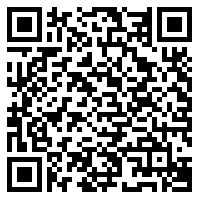
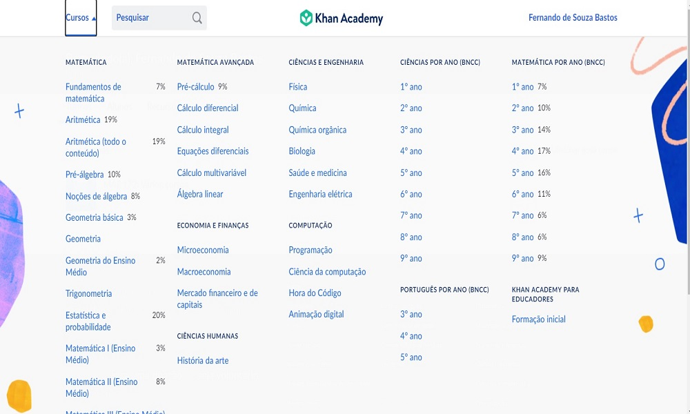
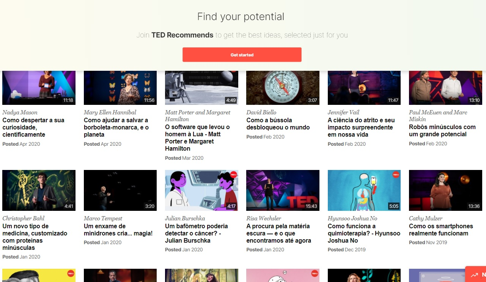
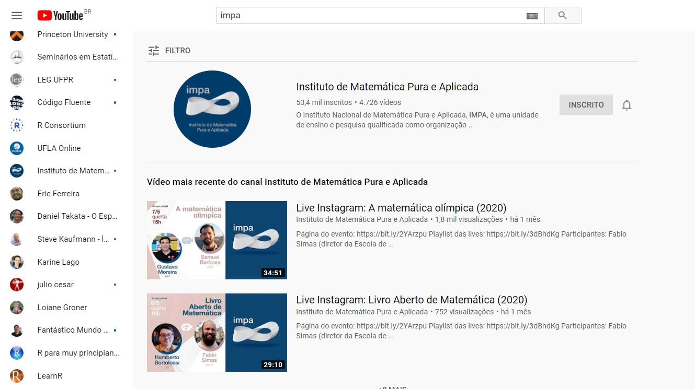

```{r, cache=FALSE, include=FALSE}
source("setup_knitr.R")
```

# Slides

.msmall[
- HTML: https://raw.githack.com/fsbmat-ufv/ColegioTiradentes/master/slides/ColTiradentes.html#1
<!-- - PDF: endereco_aqui.pdf -->
- Código-fonte: https://github.com/fsbmat-ufv/ColegioTiradentes/tree/master/slides
]

```{r, echo=FALSE, out.width='50%'}

```


---
# Introdução

```{r, echo=FALSE,out.width="49%", out.height="20%",fig.cap=" ",fig.show='hold',fig.align='center'}
knitr::include_graphics(c("../img/BabyBoomers.jpg","../img/GeracaoX.jpg"))
```

.msmall[
.pull-left-50[
**Baby Boomers (1946 - 1964):**

- Jovens durante as décadas de 60 e 70;
- Acompanharam de perto mudanças culturais;
- Acompanharam de perto mudanças sociais;
- Não participaram das Evoluções Tecnológicas.
]
.pull-right-50[
**Geração X (1960 - 1980):**

- Ainda estão trabalhando;
- Aprenderam pouco sobre tecnologia;
- Não acreditaram, no início, na evolução tecnológica;
- Tentam impor um modelo do passado na geração presente.
]
]

---

```{r, echo=FALSE,out.width="49%", out.height="20%",fig.cap=" ",fig.show='hold',fig.align='center'}
knitr::include_graphics(c("../img/GenerationY.png","../img/GenerationZ.jpg"))
``` 

.msmall[
.pull-left-50[
**Geração Y (1980 - 2000):**

- Grandes avanços tecnológicos;
- Prosperidade Econômica e facilidades;
- Ambiente urbanizado;
- Smartphones (telefones inteligentes);
- Alunos das Universidades e Faculdades;
- Iniciando no mercado de trabalho.
]
.pull-right-50[
**Geração Z (2000 - 2020):**

- Nativos digitais;
- Geração google;
- Conectadas;
- Necessidade de alfabetização tecnológica versus geração kkk;
- Nossos alunos nas Escolas de Ensino Fundamental e Médio;
- Cobaias na Evolução "precoce" das atividades remotas e/ou EAD!
]
]

---
# Momento em que Vivemos...

## *Evolução*
<p style="text-align: justify;">
O momento em que vivemos é uma mistura de gerações que está sofrendo para se adaptar a uma evolução precoce, mal formatada, não pensada e, de certa forma, imposta como realidade. Estamos adiantando, talvez cerca de 15 a 20 anos, no que diz respeito ao Ensino e Aprendizado com uso de tecnologias. De forma muito precária, pois esta evolução se deu ainda, apenas a partir do uso de tecnologias de interação online, tais como ZOOM, google meet ou outras ferramentas semelhantes. 
</p>
---
# Demoramos para perceber...

```{r, echo=FALSE,out.width="49%", out.height="20%",fig.cap=" ",fig.show='hold',fig.align='center'}
knitr::include_graphics(c("../img/cell1.jpg","../img/cell2.jpg"))
``` 
<p style="text-align: justify;">
De fato, não nos demos conta, mas a tecnologia, o uso de celular e de ferramentas tecnológicas já tomam conta da mente de nossos alunos, muito antes dessa pandemia.
</p>

---
<p style="text-align: justify;">
O fato é, que agora, ou os professores se adaptam a ferramentas de Ensino online, ou saem do mercado! E os alunos que antes poderiam ter dificuldades ou não aceitariam tão facilmente, já entenderam ou, acabarão entendendo, que é possível estudar online. Além disso, empresas que antes realizavam somente eventos presenciais, farão somente evento online daqui em diante, pois podem alcançar um público maior. Isso tudo, sem sair de casa, ou seja, sem perder tempo com deslocamentos.
</p>
---
<p style="text-align: justify;">
A pandemia não é bem vinda e ninguém deseja que ela permaneça, mas o fato é que ela adiantou alguns processos e fenômenos. Um deles, é a necessidade de profissionais que saibam trabalhar com o computador, o smartphone e outras ferramentas tecnológicas. Além disso, muitos processos serão automatizados daqui em diante, substituindo o trabalho humano. Não podemos fechar os olhos para essa verdade, ou nos adiantamos e nos aperfeiçoamos nos diversos recursos tecnológicos, ou estamos fadados ao desemprego e a dificuldades financeiras.
</p>
---


```{r, echo=FALSE,out.width = "900px", fig.align='center'}
knitr::include_graphics("../img/beginWork.gif")
```

---


class: center, middle, inverse
# Ciência de Dados

---

## O que é...
<p style="text-align: justify;">
é a área que incluí informações e conceitos complexos sobre dados e análise de dados. É multidisciplinar e está estruturada em variados setores, canais e plataformas. Seu fluxo é dado por:
</p>


---
<p style="text-align: justify;">
De acordo com o [Instituto Gartner](https://www.gartner.com/en/), é possível que até o final de 2020 haja um total de 40 trilhões de gigabytes de dados no mundo. Isso significa 2,2 milhões de terabytes de novos dados gerados todos os dias. Estima-se que menos de 5% dos dados gerados são analisados e transformados em informação.
</p>
```{r, echo=FALSE,out.width = "600px", fig.align='center'}

```

---

class: center, middle, inverse
#O que é preciso para se tornar um Cientista de Dados?

---

## Ter um pensamento lógico-matemático

Estude geometria, álgebra, contagem, funções, probabilidade, matemática financeira e etc.

## Aprenda a programar

<p style="text-align: justify;">
É extremamente importante saber programar em alguma linguagem. Dê preferência a linguagens de programação consolidadas, C, C++, java, python, R e ou qualquer outra que seja de interesse do mercado. Além disso, saiba trabalhar com banco de dados, no minímo, em formatos exportados pelo Excel, xls, xlsx, csv e txt. 
</p>

## Gostar de estudar

<p style="text-align: justify;">
Ser pró-ativo e saber buscar a informação de maneira rapída depende de estudo constante e muita leitura.
</p>
---

## Salário

---

## Programação de Computador como Arte 

> *Ciência é conhecimento que entendemos tão bem que podemos ensiná-la
> para um computador. Todo o resto é arte.*

> Donald Knuth, 1974

---


class: center, middle, inverse
# Ensino Remoto

## Caixa de Ferramentas

---
```{r, echo=FALSE,out.width = "800px", out.height= "500px",fig.align='center'}

```
---

```{r, echo=FALSE,out.width = "800px", out.height= "500px",fig.align='center'}

```
---


```{r, echo=FALSE,out.width = "800px", out.height= "500px",fig.align='center'}

```
---

# Outras indicações:

- [Veduca](http://veduca.org/)`r icon::fa("external-link-alt")`
- [Udemy](https://www.udemy.com/)`r icon::fa("external-link-alt")`
- [Data Science Academy](https://www.datascienceacademy.com.br/)`r icon::fa("external-link-alt")`
- [Code Avengers](https://www.codeavengers.com/)`r icon::fa("external-link-alt")`
- [Udacity](https://www.udacity.com/)`r icon::fa("external-link-alt")`
- [Coursera](https://www.coursera.org/)`r icon::fa("external-link-alt")`
- [Estatidados](https://linktr.ee/estatidados)`r icon::fa("external-link-alt")`
- [Financial Risk Academy](https://financial-risk-academy.teachable.com/courses/)`r icon::fa("external-link-alt")`
- Telegram e Whatsapp possuem canais de livros e de ajuda em disciplinas básicas!
- [Duolingo](https://www.duolingo.com/)`r icon::fa("external-link-alt")`
- [StackOverflow](https://pt.stackoverflow.com/)`r icon::fa("external-link-alt")`
- [StackExchange](https://stackexchange.com/sites)`r icon::fa("external-link-alt")`
- Se quiser saber mais sobre cursos online gratuitos [clique aqui](https://pt.lmgtfy.com/?q=cursos+online+gratuitos)
- Softwares R, Geogebra, Excel,  linguagem Latex - [(overleaf)](https://www.overleaf.com?r=4468ebc9&rm=d&rs=b)


---

class: center, middle, inverse
# Software R

---

Após instalar o software R e abrir o programa veremos algo semelhante a:

```{r, echo=FALSE,out.width = "1000px", fig.align='center'}
knitr::include_graphics("../img/Console_R.jpg")
```

---

<p style="text-align: justify;">
Apesar de ser simples utilizar o R diretamente do seu console raiz, existe um compilador que é mais atrativo. O RStudio é o melhor ambiente disponível para programação em R. Ao abrir o RStudio, você verá 4 ambientes. Observe a figura abaixo.
</p>
```{r, echo=FALSE,out.width = "500px", fig.align='center'}
knitr::include_graphics("../img/rstudio-editor.png")
```
---

<table>
<tr><td><a href="https:fsbmat-ufv.github.io"></a></td>
    <td><a href="https:maf172.github.io"></a></td>
</tr>
</table>
<table>
<tr><td><a href="https:maf105.github.io"></a></td>
    <td><a href="https:maf261.github.io"></a></td>
</tr>
</table>

---
<table>
<tr><td><a href="https://arxiv.org/abs/2004.11470"></a></td>
    <td><a href="https://www.tandfonline.com/doi/abs/10.1080/02664763.2020.1780570?journalCode=cjas20"></a></td>
</tr>
</table>
<table>
<tr><td><a href="https://fsbmat-ufv.shinyapps.io/orcDesp/"></a></td>
    <td><a href="https://fsbmat-ufv.shinyapps.io/flexdashboard/"></a></td>
</tr>
</table>
---

# CoronaBR: Dashboard com visualizações sobre os dados da Covid 19

<table>
<tr><td><a href="https://fsbmat.shinyapps.io/CoronaBR"><center></center></a></td>
</tr>
</table>

**Vantagens**

- Apresenta dados somente sobre as cidades que possuem casos confirmados;
- Apresenta estimativa dos recuperados;
- Atualiza de 12 em 12 horas;
- Apresenta o Código Fonte.
---

# Treemap

<table>
<tr><td><a href="https://fsbmat.shinyapps.io/CoronaBR"><center></center></a></td>
</tr>
</table>

---

# Estados

<table>
<tr><td><a href="https://fsbmat.shinyapps.io/CoronaBR"><center></center></a></td>
</tr>
</table>

---

# Cidades

<table>
<tr><td><a href="https://fsbmat.shinyapps.io/CoronaBR"><center></center></a></td>
</tr>
</table>

---

# Painel Registral - Registro Civil

<table>
<tr><td><a href="https://transparencia.registrocivil.org.br/especial-covid"><center></center></a></td>
</tr>
</table>

Outras causas relacionadas também foram avaliadas, como:

- Síndrome respiratória aguda grave (SRAG)
- Pneumonia
- Insuficiência respiratória
- Septicemia (sepse/choque séptico)
- Indeterminadas (ligadas a doenças respiratórias)
- Demais óbitos (todos os outros tipos de óbitos)

---

# Período: 01 de janeiro a 28 de junho de 2020

<table>
<tr><td><a href="https://transparencia.registrocivil.org.br/especial-covid"><center></center></a></td>
</tr>
</table>

<table>
<tr><td><a href="https://transparencia.registrocivil.org.br/especial-covid"><center></center></a></td>
</tr>
</table>

.msmall[
.pull-left-50[
**2019:**

- Demais Óbitos: 311.259
- Insuficiência Respiratória: 47.302
- Pneumonia: 107.444
- Septicemia: 84.352
- Indeterminada: 3.130
- SRAG: 708
- **Total de óbitos: 554.195**
]
.pull-right-50[
**2020:**

- Demais Óbitos: 304.537
- Insuficiência Respiratória: 46.238
- Pneumonia: 89.787
- Septicemia: 74.197
- Indeterminada: 4.270
- SRAG: 8.845
- Covid19: 53.263
- **Total de óbitos: 581.137**
]
]

---

<table>
<tr><td><a href="https://transparencia.registrocivil.org.br/especial-covid"><center></center></a></td>
</tr>
</table>

.msmall[
.pull-left-50[
**2019:**

- Demais Óbitos: 171.535
- Insuficiência Respiratória: 23.902
- Pneumonia: 55.331
- Septicemia: 40.870
- Indeterminada: 1.892
- SRAG: 359
- **Total de óbitos: 554.195**
]
.pull-right-50[
**2020:**

- Demais Óbitos: 168.469
- Insuficiência Respiratória: 23.736
- Pneumonia: 47.438
- Septicemia: 35.856
- Indeterminada: 2.543
- SRAG: 4.963
- Covid19: 30.929
- **Total de óbitos: 581.137**
]
]

---

<table>
<tr><td><a href="https://transparencia.registrocivil.org.br/especial-covid"><center></center></a></td>
</tr>
</table>

.msmall[
.pull-left-50[
**2019:**

- Demais Óbitos: 137.882
- Insuficiência Respiratória: 23.358
- Pneumonia: 52.077
- Septicemia: 43.448
- Indeterminada: 1.231
- SRAG: 349
- **Total de óbitos: 554.195**
]
.pull-right-50[
**2020:**

- Demais Óbitos: 134.397
- Insuficiência Respiratória: 22.471
- Pneumonia: 42.320
- Septicemia: 38.329
- Indeterminada: 1.720
- SRAG: 3.881
- Covid19: 22.319
- **Total de óbitos: 581.137**
]
]
---

# Como a ciência funciona

[Continuar com esse site!](https://covid19br.github.io/index.html)

> *A Ciência é um processo de aprendizado da natureza, onde ideias
> concorrentes sobre como funciona o mundo são medidas contra
> observações.*

> Richard Feynman, 1965

- Descrições: incompletas
- Observações: incertas e imprecisas
- Métodos para avaliar a concordância entre as ideias e as observações =
  **Estatística**

---
# Como a ciência funciona

## Árvore de aprendizado (Platt, 1964)

1. Conceber **hipóteses alternativas**.
2. Conceber um **experimento crucial** (ou vários deles)
3. Realizar o experimento de forma a obter **resultados mais confiáveis
   possíveis**
4. **Reciclar o procedimento**
  - Criar sub-hipóteses ou hipóteses sequenciais para refinar as
   possibilidades que restam

---
# Como a ciência funciona

- Esta visão de Platt é naturalmente uma extensão lógica do trabalho de
**Popper**
>  *Uma hipótese **não pode ser provada**, apenas **desprovada** *

- A essência do método Popperiano é **"desafiar"** uma hipótese
  repetidamente.
  - Se a hipótese permanece válida então ela **não é validada**, mas
  adquire um certo **"grau de confiança"**

- Coincidindo com esta filosofia de Popper está o trabalho estatístico
de **Ronald Fisher**, **Karl Pearson**, **Jerzy Neyman** e outros, que
desenvolveram grande parte da teoria estatística atual

---
# Como a ciência funciona

## Aprendizado dedutivo-indutivo

- O processo **dedutivo-indutivo** de aprendizado é orientado pelo
  cérebro humano
- É conhecido desde o tempo de Aristóteles e faz parte de nossa
  **experiência cotidiana**

O aprendizado avança conforme ilustrado na figura abaixo (extraída de
Box, Hunter e Hunter, 2005):

```{r, echo=FALSE, out.width='70%'}
#knitr::include_graphics("../img/deduction-induction.png")
```

---
# Como a ciência funciona

## Análise de dados como arte

> *Ciência é conhecimento que entendemos tão bem que podemos ensiná-la
> para um computador. Todo o resto é arte.*

> Donald Knuth, 1974

O processo de análise de dados por um pesquisador pode ser comparado ao
processo de **criação de uma música por um músico**.

Os métodos já foram ensinados ao computador, cabe ao analista **saber
como juntar as ferramentas** e aplicá-las para responder questões
relevantes para a ciência e para as pessoas.

---
class: center, middle, inverse
# Replicação e reprodução na Ciência

---
# Replicação e reprodução na Ciência

- A **replicação** é um dos pilares fundamentais da ciência.

- É necessário que diversos cientistas coletem e analisem dados de forma
**independente**, e cheguem no **mesmo resultado**.

- Se muitas pessoas diferentes chegarem à mesma conclusão de forma
independente
  - Tendemos a pensar que o **resultado provavelmente é verdadeiro** (que
  vai de encontro com a filosofia de Popper)

---
# Replicação e reprodução na Ciência

**Replicação**: quando o pesquisador é capaz de chegar nos mesmos
resultados de um estudo anterior, seguindo os **mesmos métodos**, mas
com coleta de **novos dados**.

```{r, out.width='65%', echo=FALSE}
#knitr::include_graphics("../img/replication.png")
```

---
# Replicação e reprodução na Ciência

Hoje em dia, a replicação tem se tornado **cada vez mais desafiadora**:

- Estudos maiores e mais caros
- Disponibilidade de recursos financeiros para pesquisas cada vez mais
  escassa

Além disso, existem estudos que **dificilmente podem ser replicados**:

- Avaliação do impacto de um terremoto
- Evolução do crescimento de uma floresta
- Estudo clínico que acompanhou as reações de pacientes à um medicamento
  durante 20 anos

---
# Replicação e reprodução na Ciência

- Existem muitas boas razões pelas quais não podemos replicar um estudo

- Se replicar não é possível, então existem duas opções:

1. Não fazer nada (não é uma opção de verdade)
2. Reproduzir a pesquisa

A ideia é criar uma espécie de **padrão mínimo**, ou um **meio-termo**
entre replicar um estudo e não fazer nada.

---
# Replicação e reprodução na Ciência

[Peng, 2011,
*Science*](http://science.sciencemag.org/content/334/6060/1226.full)

<br>

```{r, out.width='100%', echo=FALSE}
#knitr::include_graphics("../img/F1.large.jpg")
```

---
# Replicação e reprodução na Ciência

**Reprodução**: quando o pesquisador é capaz de chegar nos mesmos
resultados de um estudo anterior, seguindo os **mesmos métodos**, e
utilizando os **mesmos dados**.

```{r, out.width='70%', echo=FALSE}
#knitr::include_graphics("../img/reproduction.png")
```

---
# Replicação e reprodução na Ciência

Uma parte fundamental da **pesquisa reproduzível** é tornar disponíveis
- Dados
- Métodos computacionais (em forma de **código**)

<br>

> Um projeto científico é **computacionalmente reproduzível** se um
segundo pesquisador (**incluindo você no futuro**) é capaz de recriar os
resultados finais do projeto, incluindo as descobertas quantitativas,
tabelas e figuras, **dado apenas um conjunto de arquivos e instruções
escritas**.

> *Justin Kitzes*

---
# Replicação e reprodução na Ciência

Se reproduzir uma análise leva à um resultado já conhecido e esperado,
então **qual o propósito de uma pesquisa reproduzível**?

.msmall[
.pull-left-60[
**Para a Ciência:**

- Padrão para **julgar** descobertas científicas
- **Validação** da análise de dados
- Diferentes cientistas, com diferentes visões e ideias podem colaborar
  no sentido de continuar a pesquisa, ou sugerir outras abordagens
  (**análise de dados como arte**)
- Reprodutibilidade aprimora a replicabilidade
- Evita esforço duplicado e encoraja o desenvolvimento cumulativo de
  conhecimento
]
.pull-right-40[
**Para você:**

- **Maior impacto da pesquisa**
- Melhores hábitos de trabalho
- Melhor trabalho em equipe
- Mudanças futuras são mais fáceis
]
]

---
# Replicação e reprodução na Ciência

- A revista **Science** teve uma edição inteira dedicada à
  reprodutibilidade.

- Muitas revistas científicas tem atualizado suas políticas de
  publicação, para encorajar a reprodutibilidade dos artigos publicados.
    - *Public Library of Science* (PLoS)
    - *Biostatistics*
    - *Foundation for Open Access Statistics* (FOAS)

- Cientistas estão preocupados em fazer pesquisa reproduzível, mas...
  - Mesmo na PLoS, por exemplo, cerca de 60% das publicações não
  disponibilizam dados suficientes

---
# Replicação e reprodução na Ciência

**An empirical analysis of journal policy effectiveness for computational
reproducibility**. [PNAS,
2018](http://www.pnas.org/content/115/11/2584).

*Victoria Stodden, Jennifer Seiler, and Zhaokun Ma*

- Requisitaram dados e códigos para autores de artigos da revista
  *Science* publicados após 2011 (quando a política de publicação foi
  alterada)
- Tentaram reproduzir os estudos de 204 artigos
- Obtiveram dados e códigos de 44% dos autores
- Conseguiram reproduzir 26% deles

---
# Replicação e reprodução na Ciência

```{r, echo=FALSE, out.width='55%'}
#knitr::include_graphics("../img/tab1.png")
```

[Stodden *et al*, 2018](http://www.pnas.org/content/115/11/2584).

---
# Replicação e reprodução na Ciência

Algumas respostas recebidas ([Stodden *et al*,
2018](http://www.pnas.org/content/115/11/2584)):

.msmall[

*Tenho que dizer que essa é uma **solicitação pouco usual** [...]. Peça
ao seu orientador para me mandar um email com explicações detalhadas
...*

*Os arquivos de dados permanecem sob **nossa propriedade e não são
disponibilizados de graça** ...*

*O código que escrevemos é **resultado de anos de esforço acumulado**
[...]. Os dados foram coletados por diversos colaboradores, então teria
que **pedir permissão à eles também** ...*

*Para os cálculos, eu **usei meus próprios códigos, e não há uma versão
pública deles**. Como o código **não é muito amigável**, eu prefiro não
compartilhar ...*

*Nosso código **não foi escrito pensando em ser compartilhado com outras
pessoas**. Os códigos **não são documentados**, e não temos tempo de
fazer isso ...*

*R é um software livre disponível em www.r-project.org. Como você deve
saber, **os modelos são muito complicados** [...]. Eu usei Matlab para a
geometria.*

]

---
class: center, middle, inverse
# Elementos da reprodutibilidade

---
# Elementos da reprodutibilidade

Quatro elementos principais:

1. **Dados**: Os dados utilizados na análise devem ser disponibilizados
   *da maneira como foram analisados originalmente*.
2. **Código**: O código utilizado para produzir os resultados
   apresentados.
3. **Documentação**: Descrever o **código** e os **dados** utilizados na
   análise de maneira clara.
4. **Distribuição**: Distribuir todos esses elementos de maneira que
   sejam facilmente acessíveis.

---
# Elementos da reprodutibilidade

Estudos recentes tem mostrado que cientistas passam cerca de 30% de seu
tempo escrevendo códigos.

No entanto, mais de 90% deles são primariamente *auto-didatas*, e portanto
carecem de exposição à boas práticas de desenvolvimento de *software*
como:

- Escrever códigos de fácil manutenção
- Usar um *sistema de controle de versões*
- Rastreadores de *bugs*
- Testes unitários
- Automação de tarefas

<!-- --- -->
<!-- # Elementos da reprodutibilidade -->
<!-- ## Boas práticas para a computação científica -->
<!-- [Wilson, 2014, *PLoS*, Best prectices for scientific -->
<!-- computing](https://doi.org/10.1371/journal.pbio.1001745) -->
<!-- 1. Escreva programas para humanos, não para computadores -->
<!-- 2. Deixe o computador fazer o trabalho -->
<!-- 3. Faça alterações incrementais -->
<!-- 4. Não repita você mesmo (ou outros) -->
<!-- 5. Prepare-se para erros -->
<!-- 6. Otimize código apenas depois que ele funcionar -->
<!-- 7. Documente a ideia e o propósito, não a mecânica -->
<!-- 8. Colabore -->

---
class: center, middle, inverse
# Ferramentas da reprodutibilidade

---
# Ferramentas da reprodutibilidade

**Publicar dados e códigos não é necessariamente uma tarefa trivial.**

Problemas comuns:

- Muitos autores simplesmente "colocam" arquivos na *web*.
- Existem jornais que disponibilizam materiais suplementares, mas que
  sabidamente são desorganizados ou falhos.
- Mesmo quando dados e códigos estão disponíveis, o leitor ainda tem que
  baixar dados e códigos, e então tentar juntar tudo, uma tarefa que
  geralmente não é fácil e desencoraja a maioria das pessoas.
- O leitor pode não ter os mesmos recursos computacionais que o
  autor.

---
# Ferramentas da reprodutibilidade

Existem várias ferramentas para auxiliar a tornar uma pesquisa
reproduzível. Algumas que valem a pena conhecer são:

- **R**: para análise de dados, gráficos e tabelas. **Importante:**
  software livre e de código aberto.
- **knitr** e **rmarkdown**: pacotes do R para *literate programming*.
  Permite escrever texto e código (executável) em um mesmo documento.
- **Linguagens de marcação**: instruções para estruturar um texto.
  Exemplos são LaTeX, Markdown, e HTML.
- **Editores de texto**: que permitam trabalhar com todos os formatos.
  Exemplos: Emacs, Vim, RStudio.
- **Armazenamento e versionamento**: serviços como Dropbox, mas
  principalmente Git (Github, Gitlab, etc)
- **Programas em shell**: permitem automatizar uma série de tarefas na
  camada de arquivos e dados.

---
# Ferramentas da reprodutibilidade

Algumas dicas para ajudar a tornar um projeto reproduzível:

1. Documente tudo!
2. Tudo é um arquivo (de texto)
3. Todos os arquivos devem poder ser lidos por humanos
4. Organize e "amarre" seus arquivos de forma apropriada
5. Tenha um plano para organizar, armazenar, e tornar seus arquivos
   disponíveis

---
# Ferramentas da reprodutibilidade

```{r, echo=FALSE, out.width='60%'}
#knitr::include_graphics("../img/nature_toolkit.png")
```
[Nature, 2018](https://www.nature.com/articles/d41586-018-05990-5)

- **Use code**
- **Go open-source**
- **Track your versions**
- **Document your analyses**
- **Archive your data**
- **Replicate your environment**
- **Automate**
- **Get help**. [Software Carpentry](https://software-carpentry.org/).

---
# Ferramentas da reprodutibilidade

## Documentos dinâmicos

> *Instead of imagining that our main task is to instruct a computer what
> to do, let us concentrate rather on explaining to humans what we want
> the computer to do.*
>
> Donald Knuth

Uma das ferramentas mais importantes para pesquisa reproduzível nos dias
de hoje.

A proposta é de distribuir dados e códigos **documentados** de uma
pesquisa científica, de maneira acessível e auto-contida.

---
# Ferramentas da reprodutibilidade

## Documentos dinâmicos

Decorre diretamente de *literate programming* (Knuth, 1984)

- Da mesma forma que um *software* possui seu código-fonte, um documento
dinâmico é o código-fonte de um relatório.
- É uma combinação de código de computador e a descrição dos resultado
  que o código está gerando
- Quando **compilamos** o documento, o código é executado, assim obtemos
um documento que mistura **código** e **texto**

No R:

- `Sweave`
- `knitr`
- `rmarkdown`

---
# Ferramentas da reprodutibilidade

## Documentos dinâmicos

Para detalhes veja:

[Pesquisa reproduzível com o R: de documentos dinâmicos a
pacotes](http://cursos.leg.ufpr.br/prr/index.html)
`r icon::fa("external-link-alt")` (Fernando Mayer e Walmes Zeviani)

1. [Literate programming](http://cursos.leg.ufpr.br/prr/capLitProg.html)
 `r icon::fa("external-link-alt")`
2. [Markdown com Pandoc](http://cursos.leg.ufpr.br/prr/capMarkdown.html)
 `r icon::fa("external-link-alt")`
3. [Documentos dinâmicos no
   R](http://cursos.leg.ufpr.br/prr/capDocDin.html)
 `r icon::fa("external-link-alt")`

---
# Ferramentas da reprodutibilidade

## Distribuição de dados

A disponibilização (e aquisição) de dados abertos pode ser feita através
de **repositórios de dados**.

- [figshare](https://figshare.com/): permite publicar individualmente
  figuras, imagens, tabelas, vídeos, e dados. Cada compartilhamento
  possui um **DOI**, e assim pode ser referenciado e citado.
- [zenodo](https://zenodo.org/): compartilhamento de texto e dados.
  Também possui DOI e identifica pesquisadores pelo
  [Orcid](https://orcid.org/).
- [Nature recommended data
  repositories](https://www.nature.com/sdata/policies/repositories):
  compilação de diversos repositórios de áreas específicas
- [re3data](https://www.re3data.org/): *REgistry of REsearch Data
  REpositories* é um buscador de bases de dados abertos

---
# Ferramentas da reprodutibilidade

## "Empacotando" tudo junto

Para garantir a reprodutibilidade, o ideal é distribuir dados, códigos,
documentos dinâmicos, etc, em um único "pacote". Algumas formas de fazer
isso:

- Criando um pacote no R
  - Scripts como funções e documentos dinâmicos como *vignettes*
  - Ajuda (mas não garante) que os pacotes utilizados sejam das mesmas
    versões
  - Veja [Pacotes R](http://cursos.leg.ufpr.br/prr/capPacR.html)
  `r icon::fa("external-link-alt")`

---
# Ferramentas da reprodutibilidade

## "Empacotando" tudo junto

Para garantir a reprodutibilidade, o ideal é distribuir dados, códigos,
documentos dinâmicos, etc, em um único "pacote". Algumas formas de fazer
isso:

- Usando um "gerenciador de pacotes locais" ou "gerenciador de
  ambientes" no R
  - Cria um **ambiente auto-contido**, incluindo todos os pacotes
    necessários em suas versões específicas
  - Antigamente: `packrat`, hoje: `renv`
  - Toda a estrutura de um projeto é compartilhada *as is* (dados,
    scripts, documentos dinâmicos, etc)
  - **Garante** que os pacotes utilizados por qualquer pessoa, em
    qualquer tempo, sejam sempre os mesmos
  - Veja [renv: Project Environments for
  R](https://kevinushey-2020-rstudio-conf.netlify.app/slides.html)

---
# Ferramentas da reprodutibilidade

## "Empacotando" tudo junto

Para garantir a reprodutibilidade, o ideal é distribuir dados, códigos,
documentos dinâmicos, etc, em um único "pacote". Algumas formas de fazer
isso:

- Criando uma imagem Docker
  - Proposta muito mais genérica do que as anteriores
  - Usa o conceito de virtualização (a nível de SO) para criar
    **containers**: "blocos" auto-contidos com todos os softwares
    necessários (em versões específicas)
  - **Garante** a reprodutibilidade de maneira muito mais geral
  - É mais complexo do que as soluções anteriores
  - Veja: [A Docker tutorial for reproducible
  research](https://ropenscilabs.github.io/r-docker-tutorial/)

---
class: center, middle, inverse
# Mais recursos

---
# Mais recursos

- [R para pesquisa
  científica](http://leg.ufpr.br/~fernandomayer/aulas/reco/). Disciplina
  ministrada no PPG Ecologia e Conservação (UFPR)
- Software Carpentry [Lessons](https://software-carpentry.org/lessons/)
- [Reproducibility in
  Science](http://ropensci.github.io/reproducibility-guide/). A Guide to
  enhancing reproducibility in scientific results and writing (rOpensci)
- [Pesquisa reproduzível com R: de documentos dinâmicos a
  pacotes](http://cursos.leg.ufpr.br/prr/): minicurso realizado na RBRAS
  2016 pelos Professores Fernando Mayer e Walmes Zeviani.
- [R Markdown](https://youtu.be/qFh4XtckP2k): vídeo apresentando a
  funcionalidade do R Markdown (2015, Meetup R São Paulo).

---
# Referências

- Box, GEP; Hunter, JS; Hunter, WG. [Statistics for experimenters:
  Design Innovation and Discovery](http://statisticsforexperimenters.net).
  John Wiley & Sons, 2005.
- Kitzes, J., Turek, D., & Deniz, F. (Eds.). (2018). [The Practice of
  Reproducible Research: Case Studies and Lessons from the
  Data-Intensive
  Sciences](https://www.practicereproducibleresearch.org/).
  Oakland, CA: University of California Press
- Gandrud, C. (2015). [Reproducible Research with R and R
  Studio](https://www.crcpress.com/Reproducible-Research-with-R-and-R-Studio-Second-Edition/Gandrud/p/book/9781498715379)
- Stodden, V., Leisch, F., Peng, RD. (2014). [Implementing Reproducible
  Research](https://www.crcpress.com/Implementing-Reproducible-Research/Stodden-Leisch-Peng/p/book/9781466561595)
- Gentleman, R, Lang, DT. (2012). [Statistical Analyses and Reproducible
  Research](http://www.tandfonline.com/doi/abs/10.1198/106186007X178663).
  Journal of Computational and Graphical Statistics.

---
class: center, middle, inverse
# Obrigado!
